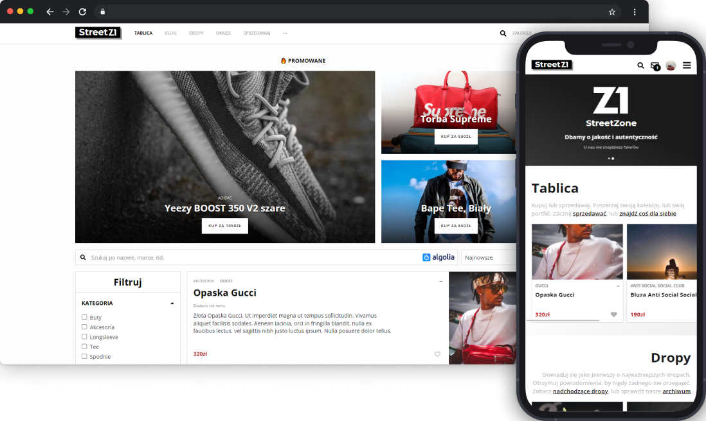

# StreetZone

## 📑 Table of contents
* [General info](#ℹ-general-info)
* [Technologies](#-technologies)
* [Migration notice](#-migration-in-progress)
* [View project](#-view-project)
* [Notes to self](#notes-to-self)

## ℹ General info

Community hub for Streetwear enthusiasts. Including a marketplace, blog, instant messaging, email and social authentication, and more.

A more detailed description is available on [my website](https://hadrysmateusz.com/project/streetzone) 📖

## 🛠 Technologies

Some of the technologies used in this project:
- [React](https://reactjs.org)
- JavaScript & [TypeScript](https://www.typescriptlang.org)
- [Algolia Search](https://www.algolia.com)
- [Firebase](https://firebase.google.com)
- [styled-components](https://styled-components.com)
- [Axios](https://github.com/axios/axios)

## 🚧 Migration in progress

The project is currently being migrated to TypeScript and currently contains both JavaScript and TypeScript code.

> ⚠ _The app may not be fully stable until the transition is complete._

## 👀 View project

While the project was never launched to the public, it can still be [viewed live here](https://streetwear-app.web.app).

## Notes to self

### Do this after cloning the repo

- run `npm i -g firebase-tools` to install firebase cli, then login
- run firebase functions:config:set name="value" inside functions folder to set algolia keys

### Other

- when deploying make sure the correct environment is selected using `firebase use`
- make sure config variables are correct for all environments in src/components/Firebase/config
  - to get web app config options run `firebase apps:sdkconfig web`
- frontend environment variables are included in the static bundle and as such they aren't secret
